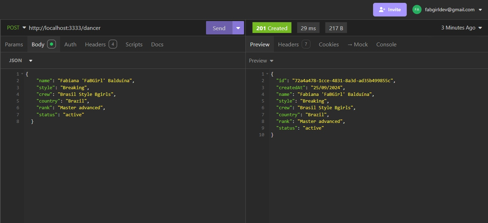
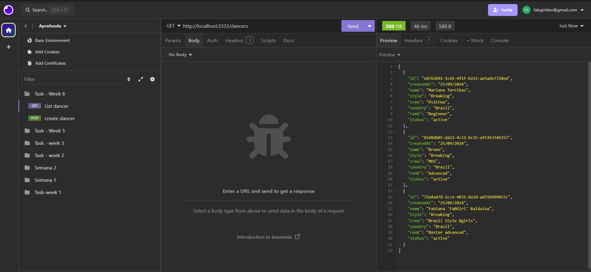
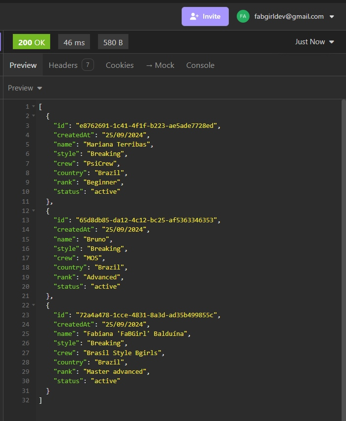
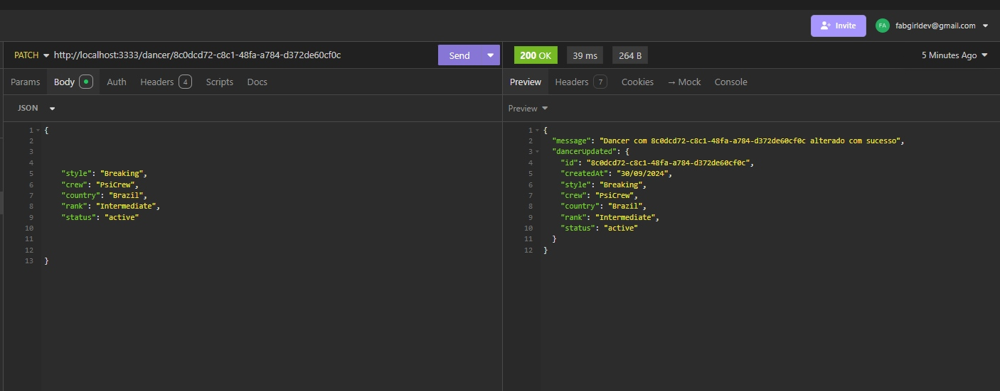
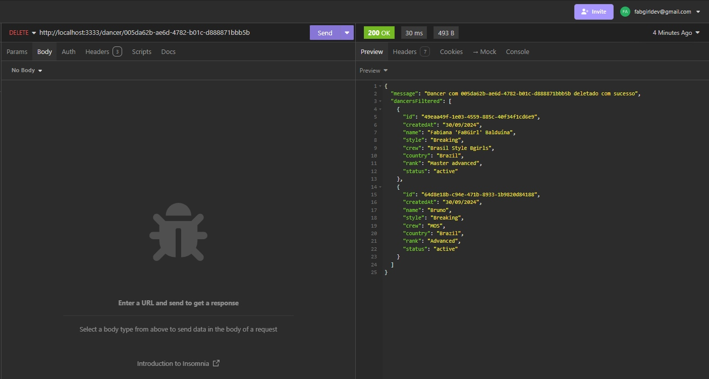

# Tarefa Semana 6 - Criação da API para Adotar Clean Architecture

## Descrição

### Requisitos da Tarefa:
- Criar um novo projeto usando clean architecture e TypeScript- 

### Principais Tecnologias Utilizadas: 🚀
1. Node.js;
2. TypeScript;
3. insomnia para testes das rotas.

### Funcionalidades: 
- CREATE (criar)
- LISTALL (listar tudo)
- UPDATE (atualizar)
- DELETE (deletar)

### Testes Realizados no Insomnia: 🧪
Criação de um dancer: ⏬

Listagem de todos os dancers criados - imagem 1: ⏬

Listagem de todos os dancers criados - imagem 2: ⏬

 

Atualização de dancer pelo ID - imagem 2: ⏬

Dancer deletada/o pelo ID - imagem 3: ⏬

## O que Estudei Esta Semana:  📚🤓💻
Durante esta semana, na formação Aprofunda PretaLab, estudamos TypeScript, Testes Unitários e os princípios da Arquitetura Limpa, aprendendo como refatorar e organizar o código de forma modular e escalável, separando responsabilidades para melhorar a estrutura e facilitar futuras manutenções.